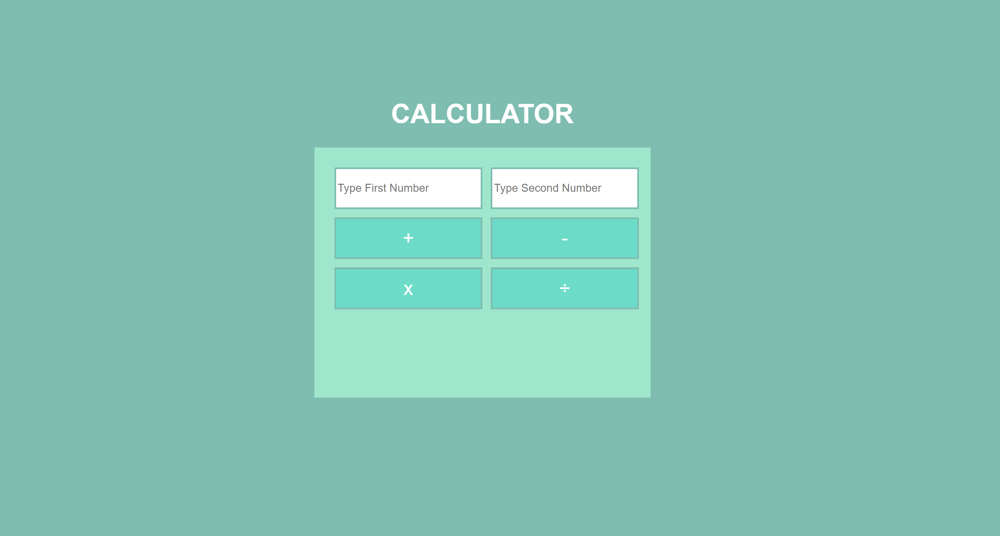

# Simple-Calculator

Live Code: https://kimflores-calculator.netlify.app

# How It's Made:
### Tech used: 

**HTML, CSS, and JavaScript**

The wireframe for this project was straightforward with the HTML having two inputs and four operational buttons. I wrote up some psuedo code to think about how I and what direction I go in terms of the JS logic. I ended up making seperate functions for each operation. 

# Lessons Learned:
When retrieving the inputs from the calculator into JavaScript, I learned that I needed to convert the string into a number using ParseInt() nad targeting the value inorder for the operations to apply. As well as creating a function that would allow the user to input a new set of numbers without having to manually refresh the browser. 

# Examples:

Take a look at these couple examples that I have in my own portfolio:

Parchment Sword or Blade: https://kimflores-parchment-stone-blade.netlify.app

Horoscope: https://github.com/Kim-Flores/Horoscope

Slot Machine: https://github.com/Kim-Flores/slot-machine-2019-week05/tree/answer

To-Do List: https://github.com/Kim-Flores/todo-list-2019-week05/tree/answer

